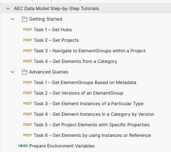

# AEC Data Model Step-by-Step Tutorial

## Description
This repository contains a set of API working as tutorial of AEC Data Model workflow to help you understand. The collection contains the GraphQL requests covering the [Step-by-Step Tutorials](https://aps.autodesk.com/en/docs/aecdatamodel/v1/tutorials/). Including all the tasks of [Basic Queries](https://aps.autodesk.com/en/docs/aecdatamodel/v1/tutorials/tutorial01/) and [Advanced Queries](https://aps.autodesk.com/en/docs/aecdatamodel/v1/tutorials/tutorial02/).

## Preparation before you begin:
- Create APS App, get an ACC Account, integrate ACC account with your APS Client Key, refer [tutorial](https://tutorials.autodesk.io/#provision-access-in-other-products) for details, enable AEC Data Model in ACC Account Settings.

## Tutorials of AEC Data Model
### Prepare Environment Variables
- Setup the environment variables, please specify your information as follow:
    - client_id
    - client_secret
    - account_name
    - project_name
    - aec-dm-url

### 3 Legged Token Setup
- Get the Authorization for the collection, right click on the collection and select **Edit**, go to **Authorization** tab, make sure to use **OAuth 2.0** to get a 3 legged token, use it in the **Request Headers**.

    - Callback URL: https://www.getpostman.com/oauth2/callback
    - Auth URL: https://developer.api.autodesk.com/authentication/v2/authorize 
    - Access Token URL: https://developer.api.autodesk.com/authentication/v2/token
    - Include Scope: data:read

### Getting Started
- Task 1 – Get Hubs
- Task 2 – Get Projects
- Task 3 – Navigate to ElementGroups within a Project
- Task 4 – Get Elements from a Category

### Advanced Queries
- Task 1 – Get ElementGroups Based on Metadata
- Task 2 – Get Versions of an ElementGroup
- Task 3 - Get Element Instances of a Particular Type
- Task 4 - Get Element Instances in a Category by Version
- Task 5 – Get Project Elements with Specific Properties
- Task 6 – Get Elements with Specific Properties

## License
This sample is licensed under the terms of the [MIT License](http://opensource.org/licenses/MIT). Please see the [LICENSE](LICENSE) file for full details.

## Written by
Zhong Wu [@johnonsoftware](https://twitter.com/johnonsoftware), [APS Partner Development](http://forge.autodesk.com)
